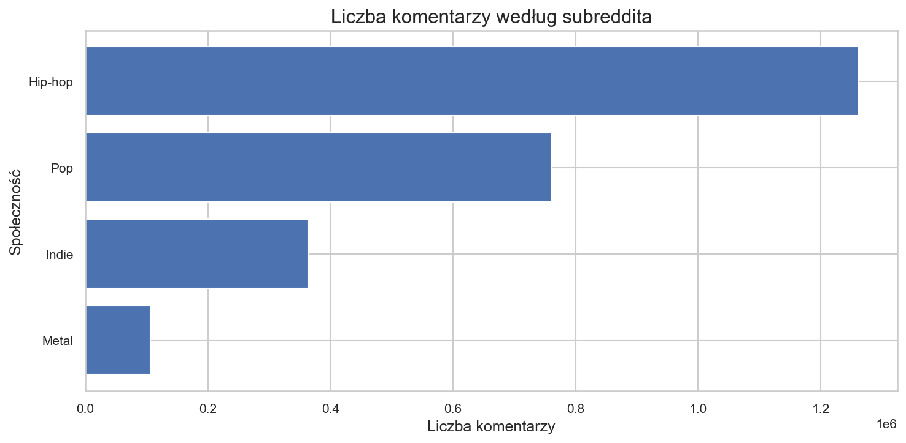
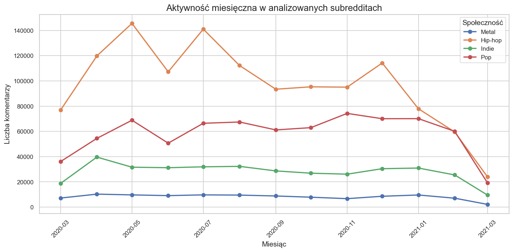
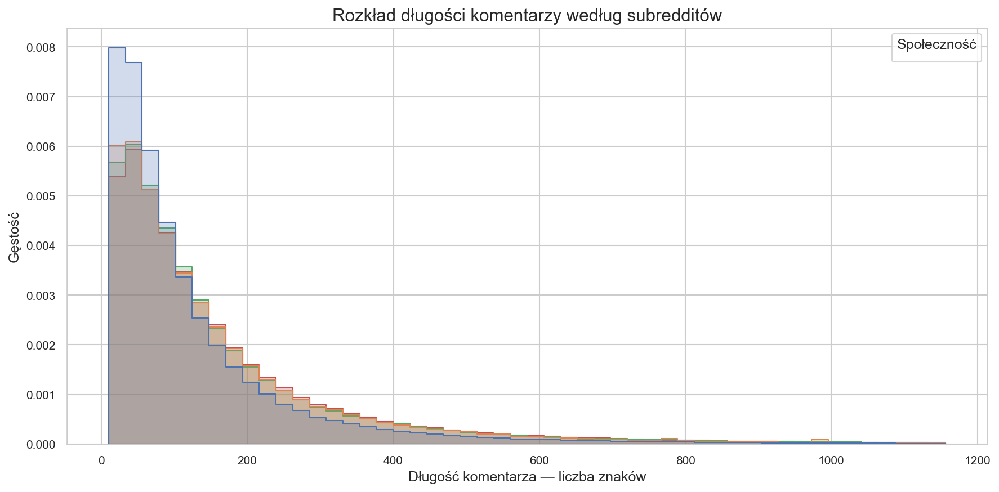
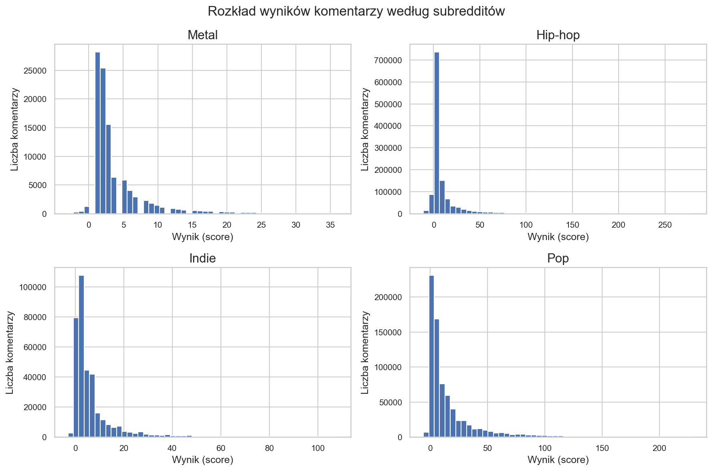
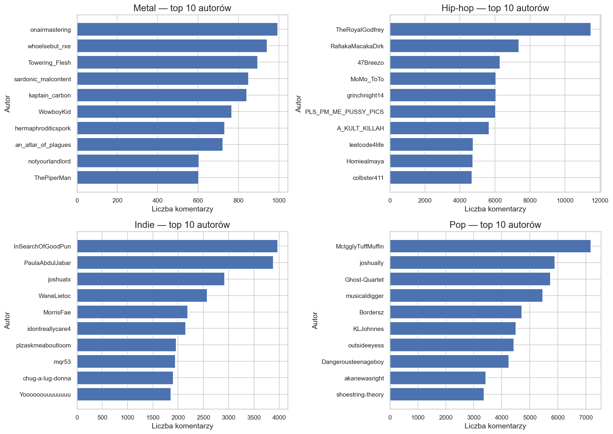

# Wnioski z analizy eksploracyjnej danych (EDA)

## Wstęp

Niniejszy podrozdział podsumowuje najważniejsze wyniki analizy eksploracyjnej (EDA) komentarzy z czterech społeczności muzycznych Reddita: r/hiphopheads, r/popheads, r/indieheads oraz r/Metal. Zbiór obejmuje okres od 11 marca 2020 r. do 11 marca 2021 r. (zgodnie z opisem w notebooku).

W analizie wykorzystano oczyszczony zbiór danych liczący **2 536 788 komentarzy**. Na etapie czyszczenia usunięto **7 395** rekordów powiązanych z kontami technicznymi/botami; w próbie nie odnotowano komentarzy o treści typu „[deleted]”/„[removed]” (podsumowanie czyszczenia: `outputs/reports/eda_cleaning_summary.csv`).

## Analiza wyników

### Skala aktywności i różnice w liczbie komentarzy

Wielkość społeczności i intensywność dyskusji istotnie różnią się pomiędzy subredditami. Największą część zbioru stanowią komentarze z r/hiphopheads (ponad połowa wszystkich rekordów), natomiast r/Metal odpowiada za niewielki ułamek danych. Jest to ważne ograniczenie interpretacyjne: wyniki „łączone” mogą w naturalny sposób odzwierciedlać przede wszystkim charakter największych społeczności.

**Tabela 1. Struktura zbioru według subredditów** (na podstawie `outputs/reports/eda_subreddit_summary.csv`).

| Subreddit     | Liczba komentarzy | Udział w zbiorze | Unikalni autorzy |
| ------------- | ----------------: | ---------------: | ---------------: |
| r/hiphopheads |         1 288 136 |           50,78% |          109 732 |
| r/popheads    |           776 846 |           30,62% |           36 976 |
| r/indieheads  |           365 877 |           14,42% |           51 375 |
| r/Metal       |           105 929 |            4,18% |           16 982 |

_Rysunek 1. Liczba komentarzy według subreddita (plik: `outputs/figures/eda_comments_by_subreddit.png`)._

Zestawienie wskazuje, że r/hiphopheads i r/popheads generują zdecydowanie więcej komentarzy niż r/indieheads i r/Metal. Jednocześnie liczba unikalnych autorów nie rośnie proporcjonalnie do liczby komentarzy w każdym przypadku (np. r/indieheads ma mniej komentarzy niż r/popheads, ale więcej unikalnych autorów), co może sugerować odmienne wzorce aktywności użytkowników w społecznościach.

### Aktywność miesięczna

Aktywność w czasie (Rysunek 2) jest wyraźnie zróżnicowana, ale nie wskazuje na jeden wspólny trend dla wszystkich społeczności. Widoczne są okresy wzrostów i spadków, a układ krzywych potwierdza dominującą skalę r/hiphopheads oraz r/popheads.

Warto podkreślić ograniczenie wynikające z zakresu czasowego: w marcu 2021 r. obserwowany jest silny spadek liczby komentarzy we wszystkich subredditach, co jest spójne z faktem, że dane obejmują okres do 11 marca 2021 r. (a więc niepełny miesiąc).

_Rysunek 2. Aktywność miesięczna w analizowanych subredditach (plik: `outputs/figures/eda_monthly_activity.png`; dane źródłowe: `outputs/reports/eda_monthly_activity.csv`)._

### Rozkład długości komentarzy

Rozkłady długości komentarzy są silnie prawostronnie skośne (Rysunek 3): większość wypowiedzi jest relatywnie krótka, a dłuższe komentarze występują rzadziej. Dla czytelności wykres przedstawia rozkład przycięty do 99. percentyla (zgodnie z ustawieniem w notebooku), co ogranicza wpływ skrajnych obserwacji na skalę osi.

**Tabela 2. Długość komentarzy (znaki)** (na podstawie `outputs/reports/eda_comment_length_stats.csv`).

| Subreddit     | Mediana długości (znaki) | Średnia długość (znaki) | 95. percentyl (znaki) |
| ------------- | -----------------------: | ----------------------: | --------------------: |
| r/hiphopheads |                     82,0 |                   175,0 |                 570,0 |
| r/popheads    |                    113,0 |                   220,8 |                 718,0 |
| r/indieheads  |                    105,0 |                   182,0 |                 563,0 |
| r/Metal       |                    106,0 |                   187,1 |                 599,0 |

_Rysunek 3. Rozkład długości komentarzy według subredditów (plik: `outputs/figures/eda_comment_length_distribution.png`)._

Wyniki sugerują, że r/popheads wyróżnia się przeciętnie dłuższymi komentarzami (najwyższa średnia i najwyższy 95. percentyl). Z kolei r/hiphopheads ma najniższą medianę długości, co wskazuje na większy udział krótkich wypowiedzi w typowym (środkowym) fragmencie rozkładu.

### Rozkład score komentarzy

Rozkłady score (Rysunek 4) są również skośne: dominują komentarze o niskich wartościach, a wysokie wyniki występują rzadko, tworząc „długi ogon”. Podobnie jak w notebooku, wizualizacja rozkładu jest ograniczona do przedziału 1–99 percentyla w każdym subreddicie, aby uniknąć zdominowania wykresu przez obserwacje skrajne.

**Tabela 3. Score komentarzy** (na podstawie `outputs/reports/eda_score_stats.csv`).

| Subreddit     | Mediana score | Średni score | 95. percentyl score |
| ------------- | ------------: | -----------: | ------------------: |
| r/hiphopheads |           3,0 |        18,34 |                63,0 |
| r/popheads    |           7,0 |        21,10 |                82,0 |
| r/indieheads  |           3,0 |         9,34 |                33,0 |
| r/Metal       |           2,0 |         4,45 |                15,0 |

_Rysunek 4. Rozkład score komentarzy według subredditów (plik: `outputs/figures/eda_score_distribution.png`)._

Porównując wartości centralne, r/popheads osiąga wyższą medianę score (7) niż pozostałe społeczności (2–3). Jednocześnie średnie wartości score są istotnie wyższe od median, co jest spójne z obecnością pojedynczych komentarzy o bardzo wysokich ocenach (widoczny długi ogon rozkładu).

### Najaktywniejsi autorzy

W każdej społeczności występuje grupa autorów, którzy publikują istotnie więcej komentarzy niż pozostali (Rysunek 5). Skala tej koncentracji różni się jednak między subredditami: w r/hiphopheads najwyższe wartości dla pojedynczych autorów są zdecydowanie większe niż w pozostałych społecznościach.

**Tabela 4. Przykładowi najaktywniejsi autorzy (top 3) w każdym subreddicie** (na podstawie `outputs/reports/eda_top_authors.csv`).

| Subreddit     | Autor             | Liczba komentarzy |
| ------------- | ----------------- | ----------------: |
| r/hiphopheads | MusicMirrorMan    |            26 096 |
| r/hiphopheads | TheRoyalGodfrey   |            11 470 |
| r/hiphopheads | RafiakaMacakaDirk |             7 368 |
| r/popheads    | MusicMirrorMan    |             8 504 |
| r/popheads    | McIgglyTuffMuffin |             7 178 |
| r/popheads    | joshually         |             5 892 |
| r/indieheads  | InSearchOfGoodPun |             3 971 |
| r/indieheads  | PaulaAbdulJabar   |             3 883 |
| r/indieheads  | joshuatx          |             2 919 |
| r/Metal       | onairmastering    |               995 |
| r/Metal       | whoelsebut_rxe    |               942 |
| r/Metal       | Towering_Flesh    |               895 |

_Rysunek 5. Top 10 autorów w każdym subreddicie (plik: `outputs/figures/eda_top_authors.png`)._

Zestawienie top autorów sugeruje, że w części społeczności pojawiają się konta o bardzo wysokiej aktywności, co należy mieć na uwadze w dalszych etapach (np. w analizie tekstowej i sieciowej). Wnioski o „typowym” stylu wypowiedzi mogą w pewnym stopniu odzwierciedlać styl najbardziej aktywnych uczestników, szczególnie w subredditach o mniejszej skali.

## Podsumowanie

Analiza EDA potwierdza, że badane społeczności różnią się zarówno skalą aktywności, jak i charakterem udziału użytkowników. r/hiphopheads i r/popheads dominują pod względem liczby komentarzy, a r/Metal jest najmniejszą społecznością w zestawieniu, co ogranicza porównywalność wniosków „globalnych” i uzasadnia analizowanie subredditów osobno.

Wzorce czasowe nie wskazują na jednolity trend w całym okresie, natomiast w marcu 2021 r. obserwowany spadek aktywności jest zgodny z niepełnym zakresem danych dla tego miesiąca. Rozkłady długości komentarzy oraz score są w każdej społeczności asymetryczne, z przewagą wartości niskich i długimi ogonami, przy czym r/popheads wyróżnia się zarówno dłuższymi komentarzami, jak i wyższą medianą score. W każdym subreddicie widoczna jest obecność szczególnie aktywnych autorów, co stanowi istotny kontekst dla interpretacji dalszych analiz.
