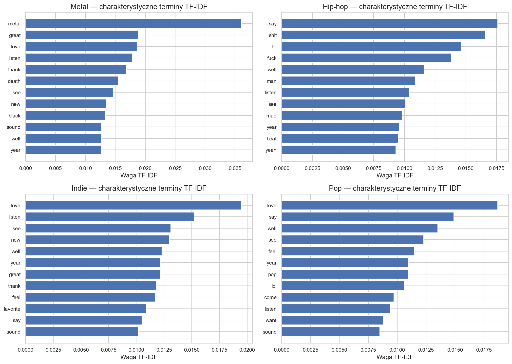
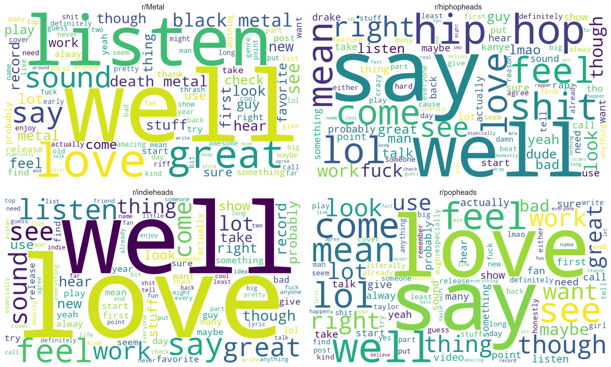
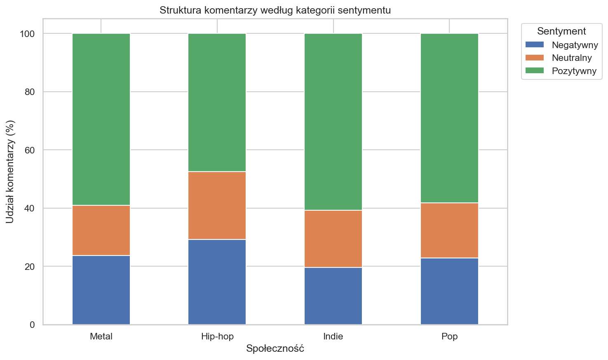
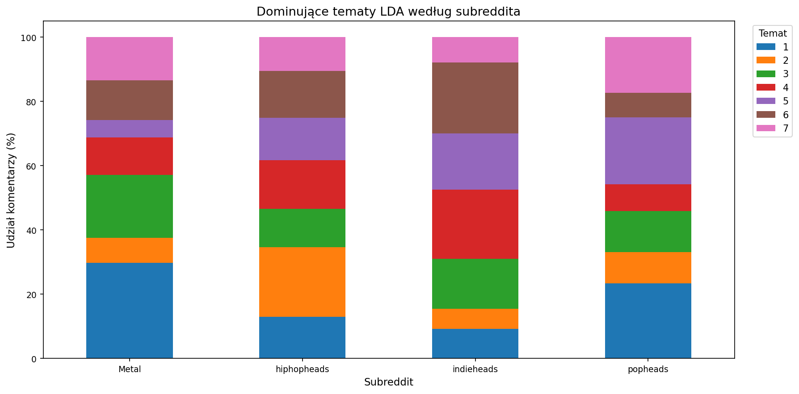

# Wnioski z analizy text mining

## Wstęp

Niniejszy podrozdział podsumowuje najważniejsze wyniki analizy tekstowej komentarzy z czterech społeczności muzycznych: hip-hop, pop, indie oraz metal. Analiza obejmuje przede wszystkim charakterystyczne słownictwo, częstość występowania słów i bigramów, sentyment komentarzy oraz tematy wyodrębnione metodą LDA.

Wyniki należy interpretować ostrożnie, ponieważ analiza tekstowa została wykonana na komentarzach z Reddita, a więc na wypowiedziach potocznych, często skrótowych, ironicznych albo silnie zależnych od kontekstu dyskusji. Szczególnie analiza sentymentu VADER może nie zawsze dobrze rozpoznawać ironię, slang muzyczny lub słowa nacechowane w danej społeczności inaczej niż w języku ogólnym.

## Analiza wyników

### Charakterystyczne słownictwo i TF-IDF

Analiza TF-IDF pokazuje, że część słownictwa jest wspólna dla wszystkich społeczności, zwłaszcza słowa związane z odsłuchem, oceną i ogólną rozmową o muzyce, takie jak listen, love, sound, year czy new. Różnice pojawiają się dopiero przy słowach bardziej osadzonych w kulturze danego gatunku. W metalu szczególnie widoczne są określenia gatunkowe i estetyczne, takie jak metal, death oraz black. W hip-hopie wyróżniają się słowa potoczne i mocniej konwersacyjne, między innymi shit, lol, fuck, man, rap i rapper. W popie częściej pojawiają się wyrazy związane z emocjonalną oceną, relacjami fanowskimi i kulturą gwiazd, na przykład love, feel, pop oraz taylor. Dyskusje indie są bardziej zbliżone do ogólnego języka odsłuchu i rekomendacji, z częstymi słowami love, listen, new, great i thank.

Tabela 1. Najważniejsze słowa według TF-IDF w poszczególnych społecznościach (na podstawie `outputs/reports/tfidf_characteristic_terms_by_subreddit.csv`).

| Społeczność | Charakterystyczne słowa |
| ----------- | ----------------------- |
| hip-hop | say, shit, lol, fuck, well, man, listen, see |
| pop | love, say, well, see, feel, pop, year, lol |
| indie | love, listen, see, new, well, great, year, thank |
| metal | metal, great, love, listen, thank, death, see, new |

_Rysunek 1. Charakterystyczne terminy TF-IDF według społeczności (plik: `outputs/figures/text_mining_tfidf_by_subreddit.png`)._

Wyniki TF-IDF sugerują, że metal jest najbardziej jednoznacznie zakotwiczony w nazwach podgatunków i słownictwie stylistycznym. Język hip-hopu jest natomiast bardziej potoczny, reakcyjny i związany z ocenianiem artystów oraz utworów. Pod tym względem pop i indie są bliższe sobie przez obecność słów pozytywnych i oceniających, choć pop częściej odsyła do konkretnych postaci sceny popularnej, a indie do słuchania, odkrywania i rekomendowania muzyki.

### Najczęstsze słowa, bigramy i chmury słów

Najczęstsze słowa potwierdzają wnioski z TF-IDF, ale pokazują też ogólny język codziennych rozmów. W każdej społeczności widoczne są słowa związane z odsłuchem i oceną, jednak bigramy lepiej wydobywają specyfikę gatunkową. W metalu dominują połączenia black metal, death metal, heavy metal i power metal, co wskazuje na silne znaczenie klasyfikacji podgatunkowej. W hip-hopie bardzo wyraźny jest bigram hip hop, ale pojawiają się też nazwy artystów, takie jak young thug, lil baby, travis scott, pop smoke i lil wayne. W popie najważniejsze bigramy są mocno związane z wykonawcami i popkulturą, na przykład taylor swift, lady gaga, dua lipa, future nostalgia, katy perry i ariana grande. W indie obok określeń gatunkowych pojawiają się nazwy wykonawców i frazy rekomendacyjne, takie jak phoebe bridger, fiona apple, tame impala, fleet fox, look forward i first listen.

_Rysunek 2. Chmury słów dla analizowanych społeczności (plik: `outputs/figures/text_mining_wordclouds.png`; dane źródłowe: `outputs/reports/top_words_by_subreddit.csv`)._

Chmury słów należy traktować raczej jako wizualne podsumowanie niż dokładne narzędzie porównawcze. Dobrze pokazują one jednak, że metal i hip-hop mają bardziej rozpoznawalne słownictwo gatunkowe, podczas gdy pop i indie częściej mieszają język emocjonalnej oceny z odniesieniami do konkretnych artystów, premier i słuchania muzyki.

### Sentyment komentarzy

Analiza sentymentu wskazuje, że we wszystkich społecznościach przeważają komentarze pozytywne, ale skala tej przewagi jest różna. Najwyższy średni sentyment występuje w indie, a następnie w popie i metalu. Wynik hip-hopu ma wyraźnie niższą średnią oraz medianę równą zero, co oznacza większy udział komentarzy neutralnych lub mieszanych. Nie musi to oznaczać po prostu „bardziej negatywnej” społeczności. W hip-hopie częściej występuje język potoczny, ironiczny i wulgarny, który może obniżać wynik sentymentu w narzędziu leksykalnym, nawet jeśli wypowiedź pełni funkcję żartu, ekspresji albo zwyczajowej reakcji w dyskusji.

Tabela 2. Sentyment komentarzy według społeczności (na podstawie `outputs/reports/sentiment_stats_by_subreddit.csv` oraz `outputs/reports/sentiment_distribution_percent.csv`).

| Społeczność | Średni sentyment | Mediana | Komentarze negatywne | Neutralne | Pozytywne |
| ----------- | ---------------: | ------: | -------------------: | --------: | --------: |
| hip-hop | 0,118 | 0,000 | 29,2% | 23,3% | 47,6% |
| pop | 0,248 | 0,318 | 22,9% | 18,9% | 58,3% |
| indie | 0,289 | 0,361 | 19,6% | 19,6% | 60,8% |
| metal | 0,238 | 0,340 | 23,7% | 17,2% | 59,1% |

_Rysunek 3. Rozkład klas sentymentu w społecznościach muzycznych (plik: `outputs/figures/text_mining_sentiment_distribution.png`)._

Najbardziej pozytywny profil ma indie, gdzie udział komentarzy pozytywnych jest najwyższy, a udział negatywnych najniższy. Profil popu również ma wysoki udział pozytywnych komentarzy, co może wiązać się z fanowskim stylem rozmów, oceną premier i ekspresją sympatii wobec wykonawców. Wyniki dla metalu są zbliżone do popu pod względem udziału komentarzy pozytywnych, mimo że jego charakterystyczne słownictwo zawiera słowa takie jak death czy black. To pokazuje, że same słowa gatunkowe nie powinny być automatycznie interpretowane jako negatywne emocjonalnie. Społeczność hip-hop wyróżnia się większym udziałem komentarzy negatywnych i neutralnych, ale ten wynik powinien być czytany razem z potocznym i często intensywnym stylem wypowiedzi w tej społeczności.

### Tematy LDA

Model LDA został uruchomiony osobno dla każdej społeczności, co pozwala porównywać wewnętrzne struktury tematów, ale nie należy traktować numerów tematów jako bezpośrednio porównywalnych między społecznościami. Wyniki spójności tematycznej są umiarkowane: najwyższy wynik uzyskał hip-hop, następnie indie i metal, a najniższy pop. Oznacza to, że tematy dają użyteczny obraz głównych motywów, ale nadal wymagają ręcznej interpretacji.

Tabela 3. Spójność modeli LDA (na podstawie `outputs/reports/lda_coherence_by_subreddit.csv`).

| Społeczność | Liczba tematów | Dokumenty użyte w modelu | Coherence c_v |
| ----------- | -------------: | -----------------------: | ------------: |
| hip-hop | 7 | 10 000 | 0,544 |
| indie | 7 | 10 000 | 0,532 |
| metal | 7 | 10 000 | 0,506 |
| pop | 7 | 10 000 | 0,477 |

Największe tematy w hip-hopie koncentrują się wokół brzmienia, rapu, beatów, wersów i nazw wykonawców, ale pojawia się też osobny obszar bardziej konwersacyjny, z językiem sporów, ocen i reakcji. W popie najwyraźniejszy temat dotyczy premier, singli, nowych wydań i emocjonalnej oceny utworów, a inne tematy odnoszą się do głosu, tekstów, list przebojów, radia oraz konkretnych artystek. Tematy indie są bardziej rozproszone między słuchaniem, odkrywaniem muzyki, oceną albumów i rozmowami o artystach. W metalu widać natomiast wyraźne tematy związane z podgatunkami, takimi jak black metal, death metal, doom, thrash i heavy metal, a także z odsłuchem i koncertowym doświadczeniem muzyki.

Tabela 4. Największe tematy LDA w każdej społeczności (na podstawie `outputs/reports/lda_dominant_topics_by_subreddit.csv` oraz `outputs/reports/lda_topics_by_subreddit.csv`).

| Społeczność | Dominujący temat | Udział komentarzy | Słowa pomocnicze do interpretacji |
| ----------- | ---------------: | ----------------: | --------------------------------- |
| hip-hop | temat 5 | 23,5% | beat, love, sound, lil, verse, rap |
| pop | temat 7 | 25,5% | year, love, release, single, new |
| indie | temat 1 | 24,8% | year, see, come, love, great, play |
| metal | temat 3 | 24,8% | see, love, great, first, listen, live |

_Rysunek 4. Dominujące tematy LDA według społeczności (plik: `outputs/figures/text_mining_lda_dominant_topics.png`)._

LDA potwierdza, że rozmowy w poszczególnych społecznościach są osadzone w różnych praktykach fanowskich. W metalu silniej widoczna jest potrzeba nazywania i rozróżniania podgatunków. W hip-hopie ważne są oceny rapu, beatów i wykonawców, ale również żywy, czasem konfliktowy język komentarzy. W popie duże znaczenie mają premiery, single, rozpoznawalne artystki i elementy przemysłu muzycznego, takie jak listy przebojów czy radio. Dyskusje indie wydają się najbardziej związane z językiem odkrywania, odsłuchu i osobistej oceny muzyki.

## Podsumowanie

Analiza text mining pokazuje, że badane społeczności różnią się nie tylko tematyką rozmów, lecz także stylem wypowiedzi. Wyniki dla metalu są najbardziej wyraźne pod względem słownictwa gatunkowego i podgatunkowego. Społeczność hip-hop ma najbardziej potoczny, ekspresyjny i momentami konfliktowy język, co jest widoczne zarówno w TF-IDF, jak i w niższym wyniku sentymentu. Obszar popu wyróżnia się odniesieniami do konkretnych artystek, premier, singli i kultury fanowskiej. Z kolei indie częściej skupia się na słuchaniu, rekomendowaniu, odkrywaniu i ogólnej ocenie muzyki.

Wyniki sentymentu wskazują, że komentarze pozytywne przeważają we wszystkich czterech społecznościach. Najbardziej pozytywny obraz uzyskało indie, a najbardziej neutralno-negatywny hip-hop, choć w tym drugim przypadku trzeba uwzględnić wpływ slangu, ironii i wulgaryzmów na wynik automatycznej klasyfikacji. Tematy LDA są spójne z wynikami TF-IDF i bigramów: każda społeczność ma własne charakterystyczne punkty ciężkości, ale wszystkie pozostają skoncentrowane wokół praktyk typowych dla dyskusji muzycznych, czyli odsłuchu, oceniania, rekomendowania, premier i rozmów o wykonawcach.
