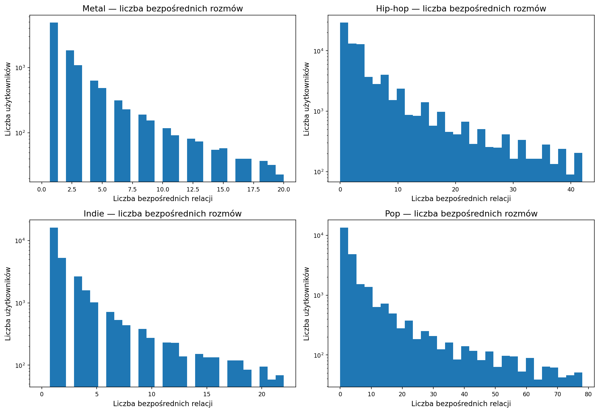
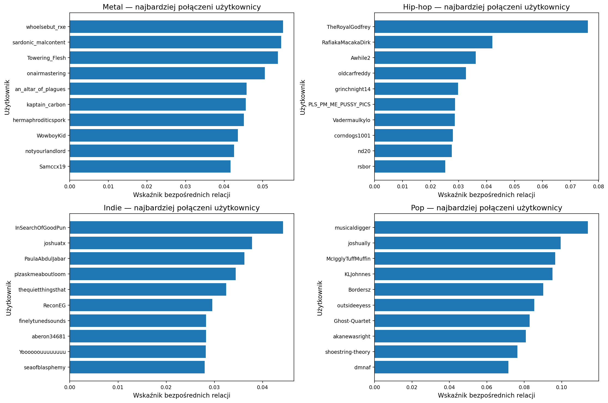
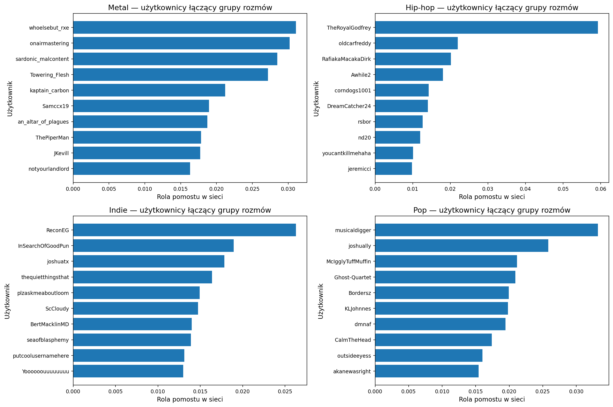
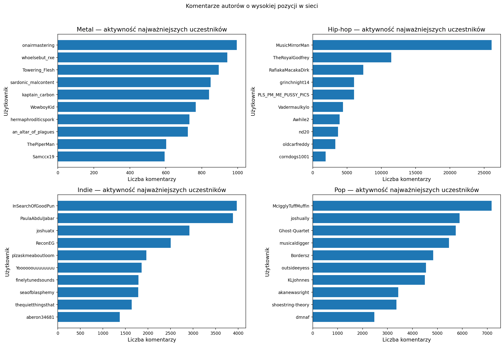

# Wnioski z analizy sieciowej

## Wstęp

Niniejszy podrozdział podsumowuje wyniki analizy sieciowej komentarzy z czterech społeczności muzycznych: hip-hop, pop, indie oraz metal. W tej części komentarze są analizowane nie przez treść, lecz przez relacje między użytkownikami. Jeżeli jeden autor odpowiadał drugiemu, traktowano to jako połączenie między nimi. Dzięki temu można było sprawdzić, czy rozmowy są rozproszone, czy skupiają się wokół kilku szczególnie aktywnych osób oraz czy w społecznościach widoczne są mniejsze grupy częściej wchodzące ze sobą w interakcje.

Wyniki należy interpretować ostrożnie. Sieć odpowiedzi nie pokazuje całego życia społeczności, ponieważ nie obejmuje biernego czytania, głosowań ani jakości wypowiedzi. Wysoka pozycja użytkownika w sieci oznacza przede wszystkim dużą widoczność w strukturze rozmów, a nie automatycznie autorytet, popularność lub pozytywny odbiór.

## Analiza wyników

### Rozmiar i ogólna struktura sieci

Największą siecią była społeczność hip-hopowa, która obejmowała ponad 83 tys. użytkowników i ponad 617 tys. relacji odpowiedzi. Pop miał mniej użytkowników niż hip-hop, ale bardzo dużą liczbę połączeń w stosunku do rozmiaru sieci. Oznacza to, że rozmowy w popie były bardziej zwarte i częściej łączyły użytkowników ze sobą. Metal był najmniejszą analizowaną społecznością, a jego sieć miała najmniej użytkowników i relacji, co jest zgodne z mniejszą skalą tej części zbioru.

Tabela 1. Podstawowe statystyki sieci (na podstawie `outputs/reports/network_basic_metrics.csv`).

| Społeczność | Użytkownicy | Relacje | Średnia liczba relacji | Największa liczba relacji jednego użytkownika | Udział największej części sieci |
| ----------- | ----------: | ------: | ---------------------: | --------------------------------------------: | ------------------------------: |
| Metal | 10 996 | 45 461 | 6,371 | 440 | 94,44% |
| Hip-hop | 83 153 | 617 923 | 11,960 | 4 327 | 98,32% |
| Indie | 32 131 | 142 887 | 6,978 | 961 | 96,18% |
| Pop | 27 142 | 317 417 | 18,537 | 2 209 | 98,37% |

_Rysunek 1. Liczba bezpośrednich relacji użytkowników w badanych społecznościach (plik: `outputs/figures/degree_distribution_networks.png`)._

Rozkład liczby relacji pokazuje typowy układ dla dyskusji internetowych: większość użytkowników ma niewiele bezpośrednich kontaktów, natomiast niewielka grupa autorów pojawia się w rozmowach bardzo często. Najbardziej wyróżnia się pop, gdzie średnia liczba relacji jest najwyższa. Hip-hop ma największą skalę i bardzo wysokie wartości skrajne, ale ze względu na ogromną liczbę użytkowników jego sieć nie jest tak jednolicie zwarta jak pop.

### Najbardziej widoczni użytkownicy

W każdej społeczności występują autorzy, którzy mają znacznie więcej bezpośrednich relacji niż pozostali. Nie zawsze są to po prostu osoby z największą liczbą komentarzy. Część użytkowników może publikować bardzo dużo, ale niekoniecznie łączyć różne fragmenty rozmowy. Dlatego w interpretacji ważne jest rozróżnienie między samą aktywnością a pozycją w sieci.

Tabela 2. Przykładowi użytkownicy z największą liczbą bezpośrednich relacji (na podstawie `outputs/reports/top_users_degree_centrality.csv`).

| Społeczność | Autor | Wskaźnik bezpośrednich relacji |
| ----------- | ----- | -----------------------------: |
| Metal | whoelsebut_rxe | 0,0553 |
| Metal | sardonic_malcontent | 0,0548 |
| Hip-hop | TheRoyalGodfrey | 0,0762 |
| Hip-hop | RafiakaMacakaDirk | 0,0420 |
| Indie | InSearchOfGoodPun | 0,0443 |
| Indie | joshuatx | 0,0378 |
| Pop | musicaldigger | 0,1141 |
| Pop | joshually | 0,0994 |

_Rysunek 2. Użytkownicy mający najwięcej bezpośrednich relacji w poszczególnych społecznościach (plik: `outputs/figures/top_degree_centrality.png`)._

W hip-hopie szczególnie widoczny był użytkownik TheRoyalGodfrey, który zajmował najwyższą pozycję zarówno pod względem bezpośrednich relacji, jak i roli pomostu między częściami sieci. W popie podobną funkcję pełnili między innymi musicaldigger, joshually i McIgglyTuffMuffin. W indie najwyżej pojawiali się InSearchOfGoodPun, ReconEG i joshuatx, natomiast w metalu whoelsebut_rxe, onairmastering i sardonic_malcontent. Te konta można traktować jako autorów szczególnie widocznych w strukturze rozmów, ale nie należy utożsamiać tego bezpośrednio z oceną jakości ich wypowiedzi.

### Użytkownicy pełniący rolę pomostów

W analizie uwzględniono również użytkowników, którzy łączą różne części sieci. Technicznie odpowiada temu miara betweenness centrality, ale w praktyce chodzi o osoby pojawiające się w różnych kręgach rozmowy i potencjalnie spajające kilka grup dyskusyjnych. Tacy autorzy są ważni, ponieważ mogą przenosić wątki, rekomendacje lub style rozmowy między fragmentami społeczności.

_Rysunek 3. Użytkownicy pełniący rolę pomostów między częściami sieci (plik: `outputs/figures/top_betweenness_centrality.png`; dane źródłowe: `outputs/reports/top_users_betweenness_centrality.csv`)._

Najbardziej wyraźny przykład widać w hip-hopie, gdzie TheRoyalGodfrey miał zdecydowanie najwyższy wynik roli pomostu. W metalu najwyżej znajdowali się whoelsebut_rxe i onairmastering, w indie ReconEG oraz InSearchOfGoodPun, a w popie musicaldigger i joshually. Wyniki sugerują, że w każdej społeczności istnieje grupa użytkowników ważnych nie tylko dlatego, że są aktywni, ale dlatego, że pojawiają się w różnych częściach sieci odpowiedzi.

### Grupy rozmów wewnątrz społeczności

Wykrywanie grup pokazało, że wszystkie analizowane społeczności dzielą się na mniejsze kręgi użytkowników częściej odpowiadających sobie nawzajem. Nie oznacza to formalnych grup, lecz raczej lokalne fragmenty dyskusji: osoby komentujące podobne wątki, wracające do tych samych tematów albo częściej spotykające się w rozmowach.

Tabela 3. Wyniki wykrywania grup w sieci (na podstawie `outputs/reports/community_detection_stats.csv`).

| Społeczność | Liczba grup | Udział największej grupy | Modularity |
| ----------- | ----------: | -----------------------: | ---------: |
| Metal | 330 | 9,88% | 0,3629 |
| Hip-hop | 747 | 22,92% | 0,3121 |
| Indie | 726 | 24,64% | 0,4123 |
| Pop | 238 | 20,19% | 0,2053 |

Najwyższy wynik modularity wystąpił w indie, co w prostym ujęciu oznacza wyraźniejsze oddzielenie lokalnych kręgów rozmowy. Indie miało więc strukturę bardziej podzieloną na mniejsze obszary interakcji. Metal również wykazywał dość widoczne grupowanie, ale największa grupa obejmowała tylko niecałe 10% użytkowników, co wskazuje na bardziej rozproszony charakter rozmów. Pop miał najniższą modularity, co sugeruje mniej wyraźne granice między grupami i bardziej połączoną strukturę dyskusji.

### Overlap użytkowników między społecznościami

Analiza wspólnych użytkowników pokazuje, że społeczności muzyczne nie są całkowicie oddzielone. Największy overlap w liczbach bezwzględnych wystąpił między hip-hopem i indie, gdzie wspólnych było 5 815 użytkowników. Duży overlap pojawił się także między hip-hopem i popem oraz między indie i popem. Metal był najbardziej odseparowany od pozostałych społeczności, szczególnie od popu.

Tabela 4. Wspólni użytkownicy między społecznościami (na podstawie `outputs/reports/cross_subreddit_user_overlap.csv`).

| Para społeczności | Wspólni użytkownicy | Udział w pierwszej społeczności | Udział w drugiej społeczności |
| ----------------- | ------------------: | ------------------------------: | -----------------------------: |
| Metal - Hip-hop | 663 | 3,90% | 0,60% |
| Metal - Indie | 472 | 2,77% | 0,92% |
| Metal - Pop | 149 | 0,88% | 0,40% |
| Hip-hop - Indie | 5 815 | 5,29% | 11,29% |
| Hip-hop - Pop | 4 896 | 4,45% | 13,22% |
| Indie - Pop | 3 389 | 6,58% | 9,15% |

_Rysunek 4. Liczba społeczności, w których aktywny był użytkownik (plik: `outputs/figures/user_subreddit_distribution.png`)._

Wyniki overlapu wskazują, że użytkownicy popu i indie stosunkowo często pojawiali się także w innych społecznościach, zwłaszcza w hip-hopie. Jednocześnie tylko 34 autorów było aktywnych we wszystkich czterech społecznościach. Oznacza to, że istnieje pewna grupa użytkowników przemieszczających się między fandomami, ale większość aktywności nadal pozostaje związana z pojedynczą lub ograniczoną liczbą społeczności.

### Aktywność a pozycja w sieci

Pomocniczy wskaźnik pozycji w sieci łączył kilka informacji: liczbę komentarzy, liczbę bezpośrednich relacji oraz rolę pomostu między grupami. Dzięki temu można było odróżnić użytkowników bardzo aktywnych od tych, którzy rzeczywiście zajmowali ważne miejsce w strukturze rozmów.

Tabela 5. Najważniejsi uczestnicy rozmów według wskaźnika pozycji w sieci (na podstawie `outputs/reports/top_structurally_central_users.csv`).

| Społeczność | Autor | Liczba komentarzy | Wskaźnik pozycji w sieci |
| ----------- | ----- | ----------------: | -----------------------: |
| Metal | whoelsebut_rxe | 942 | 0,982 |
| Metal | onairmastering | 995 | 0,962 |
| Hip-hop | TheRoyalGodfrey | 11 470 | 0,813 |
| Hip-hop | RafiakaMacakaDirk | 7 368 | 0,391 |
| Indie | InSearchOfGoodPun | 3 971 | 0,907 |
| Indie | ReconEG | 2 505 | 0,766 |
| Pop | musicaldigger | 5 462 | 0,881 |
| Pop | joshually | 5 892 | 0,781 |

_Rysunek 5. Użytkownicy o wysokiej pozycji w sieci rozmów (plik: `outputs/figures/top_structurally_central_users.png`)._

_Rysunek 6. Aktywność autorów o wysokiej pozycji w sieci (plik: `outputs/figures/centrality_vs_activity.png`)._

Porównanie aktywności i pozycji w sieci pokazuje, że sama liczba komentarzy nie wystarcza do opisania roli użytkownika. Dobrym przykładem jest MusicMirrorMan w hip-hopie: miał bardzo dużą liczbę komentarzy, ale nie był najwyżej położony pod względem roli pomostu. Z kolei TheRoyalGodfrey łączył wysoką aktywność z bardzo wyraźną pozycją w strukturze odpowiedzi. Podobnie w popie musicaldigger, joshually i McIgglyTuffMuffin byli widoczni zarówno przez aktywność, jak i przez liczbę relacji z innymi użytkownikami.

## Podsumowanie

Analiza sieciowa pokazuje, że badane społeczności muzyczne różnią się nie tylko tematyką rozmów, ale także sposobem organizacji interakcji. Hip-hop był największą i najbardziej rozbudowaną siecią, z wyraźną rolą kilku bardzo widocznych autorów. Pop miał najbardziej zwartą strukturę relacji, co sugeruje intensywniejsze powiązania między użytkownikami. Indie wyróżniało się silniejszym podziałem na lokalne kręgi rozmowy, natomiast metal był mniejszy i bardziej rozproszony.

W każdej społeczności widoczni byli użytkownicy pełniący rolę pomostów między częściami sieci. Ich znaczenie polegało nie tylko na dużej aktywności, ale na tym, że pojawiali się w różnych fragmentach dyskusji. Overlap użytkowników wskazuje, że szczególnie hip-hop, indie i pop częściowo się przenikały, podczas gdy metal pozostawał bardziej odrębny. Całość wyników sugeruje, że społeczności muzyczne na Reddicie mają własne style organizacji rozmów: od bardziej zwartego popu, przez ogromny i dynamiczny hip-hop, po bardziej segmentowane indie i mniejszy, bardziej rozproszony metal.
