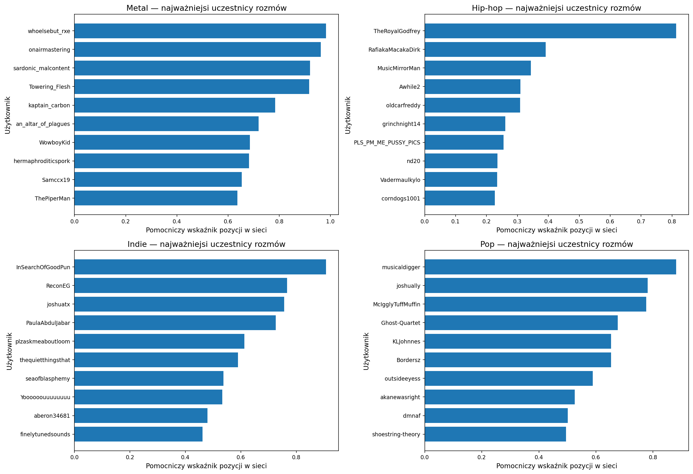
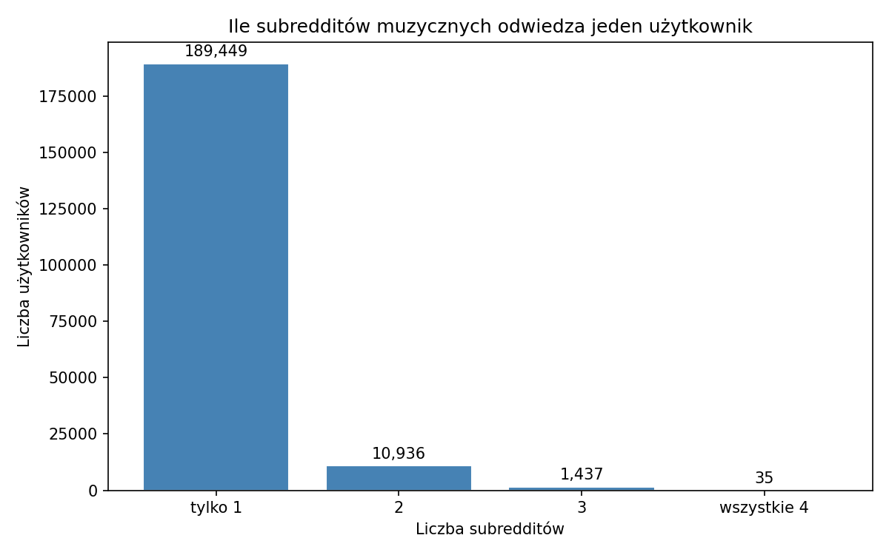

# Reddit Music Community Analysis

Projekt dotyczy analizy komentarzy z muzycznych społeczności Reddita. Celem jest porównanie tego, jak użytkownicy dyskutują o muzyce w różnych gatunkach: hip-hop, pop, indie oraz metal. Analiza obejmuje zarówno podstawową eksplorację danych, jak i elementy text mining oraz analizę sieciową.

Projekt ma charakter akademicki i jest przygotowany jako część pracy badawczej nad społecznościami muzycznymi online. Najważniejsze pytania dotyczą aktywności użytkowników, języka komentarzy, sentymentu wypowiedzi, tematów dyskusji oraz struktury relacji między autorami.

W projekcie wykorzystano między innymi:

- EDA, czyli eksploracyjną analizę danych,
- analizę aktywności użytkowników,
- TF-IDF i analizę charakterystycznego słownictwa,
- analizę sentymentu VADER,
- modelowanie tematów LDA,
- chmury słów i analizę bigramów,
- analizę sieci odpowiedzi między użytkownikami,
- wykrywanie grup użytkowników w sieci.

## Struktura projektu

Repozytorium zostało uporządkowane tak, aby rozdzielić dane wejściowe, notebooki, wyniki i pliki pomocnicze.

```text
data/
  raw/              surowe pliki .zst z komentarzami z Reddita
  processed/        przygotowane pliki CSV używane w notebookach
  checkpoints/      checkpointy .pkl i pomocnicze pliki do wznawiania analiz

notebooks/
  01_eda_uporzadkowany.ipynb
  02_text_mining_uporzadkowany.ipynb
  03_network_analysis_uporzadkowany.ipynb

outputs/
  figures/          wykresy zapisywane jako .png
  reports/          tabele i wyniki zapisywane jako .csv

src/
  scan_dates.py     sprawdzenie zakresu dat w plikach źródłowych
  extract_data.py   ekstrakcja i filtrowanie komentarzy do CSV

01_eda_wnioski.md
02_text_mining_wnioski.md
03_network_analysis_wnioski.md
```

Folder `figures/` znajduje się w `outputs/figures`, a folder `reports/` w `outputs/reports`. Checkpointy są przechowywane w `data/checkpoints`.

## Notebooki

Główne wersje notebooków mają dopisek `_uporzadkowany`. Starsze, robocze wersje notebooków nie są już częścią aktualnego przepływu pracy.

| Notebook | Cel | Najważniejsze wyniki |
| -------- | --- | -------------------- |
| `01_eda_uporzadkowany.ipynb` | Wstępne rozpoznanie danych i aktywności w społecznościach. | Liczba komentarzy, liczba autorów, aktywność miesięczna, długość komentarzy, score, najaktywniejsi autorzy. |
| `02_text_mining_uporzadkowany.ipynb` | Analiza języka komentarzy. | Najczęstsze słowa, bigramy, TF-IDF, chmury słów, sentyment VADER, tematy LDA. |
| `03_network_analysis_uporzadkowany.ipynb` | Analiza relacji między użytkownikami na podstawie odpowiedzi. | Sieci użytkowników, podstawowe statystyki grafów, centralność, użytkownicy-pomosty, overlap społeczności, grupy rozmów. |

Każdy notebook zapisuje wyniki do `outputs/figures` oraz `outputs/reports`. Pliki z wnioskami (`01_eda_wnioski.md`, `02_text_mining_wnioski.md`, `03_network_analysis_wnioski.md`) zawierają krótką interpretację wyników w formie bardziej opisowej.

## Dane

Dane pochodzą z Reddita i obejmują komentarze użytkowników z czterech społeczności muzycznych:

- `r/hiphopheads`,
- `r/popheads`,
- `r/indieheads`,
- `r/Metal`.

Surowe dane znajdują się w `data/raw` jako pliki `.zst`. Po ekstrakcji i przygotowaniu dane robocze trafiają do `data/processed`. Głównym plikiem używanym w aktualnych notebookach jest:

```text
data/processed/all_subreddits_sample.csv
```

W analizach porównawczych nazwy społeczności są prezentowane w prostszej formie: Hip-hop, Pop, Indie i Metal.

## Wyniki projektu

Projekt generuje dwa główne typy wyników:

- wykresy PNG w `outputs/figures`,
- tabele CSV w `outputs/reports`.

Wyniki obejmują aktywność użytkowników, rozkłady długości komentarzy i score, charakterystyczne słownictwo, sentyment komentarzy, tematy LDA, strukturę sieci odpowiedzi oraz overlap użytkowników między społecznościami.

### Przykładowe wykresy

Aktywność społeczności różni się przede wszystkim skalą. Hip-hop i pop mają najwięcej komentarzy, natomiast metal jest najmniejszą społecznością w zbiorze.


_Liczba komentarzy według społeczności._

Analiza TF-IDF pokazuje słownictwo najbardziej charakterystyczne dla poszczególnych społeczności.


_Charakterystyczne terminy TF-IDF według społeczności._

Analiza sentymentu pozwala porównać emocjonalny charakter komentarzy. Wyniki trzeba jednak czytać ostrożnie, ponieważ Reddit zawiera dużo ironii, slangu i potocznego języka.


_Rozkład klas sentymentu w społecznościach muzycznych._

Analiza sieciowa pokazuje, którzy użytkownicy mają szczególnie dużo relacji z innymi oraz gdzie rozmowy są bardziej skupione wokół aktywnych uczestników.



_Użytkownicy o wysokiej pozycji w sieci rozmów._

Overlap użytkowników między społecznościami jest analizowany w tabelach CSV oraz przez rozkład liczby społeczności, w których aktywny był dany autor.



_Liczba społeczności, w których aktywny był użytkownik._

### Przykładowe tabele

Fragment tabeli z podstawową strukturą zbioru (`outputs/reports/eda_subreddit_summary.csv`):

| Społeczność | Liczba komentarzy | Udział w zbiorze | Unikalni autorzy |
| ----------- | ----------------: | ---------------: | ---------------: |
| Hip-hop | 1 262 005 | 50,63% | 109 727 |
| Pop | 761 532 | 30,55% | 36 974 |
| Indie | 363 300 | 14,57% | 51 371 |
| Metal | 105 927 | 4,25% | 16 982 |

Fragment wyników sentymentu (`outputs/reports/sentiment_distribution_percent.csv`):

| Społeczność | Negatywne | Neutralne | Pozytywne |
| ----------- | --------: | --------: | --------: |
| Metal | 23,7% | 17,2% | 59,1% |
| Hip-hop | 29,2% | 23,3% | 47,6% |
| Indie | 19,6% | 19,6% | 60,8% |
| Pop | 22,9% | 18,9% | 58,3% |

Fragment wyników sieciowych (`outputs/reports/network_basic_metrics.csv`):

| Społeczność | Użytkownicy | Relacje | Średnia liczba relacji | Udział największej części sieci |
| ----------- | ----------: | ------: | ---------------------: | ------------------------------: |
| Metal | 10 996 | 45 461 | 6,371 | 94,44% |
| Hip-hop | 83 153 | 617 923 | 11,960 | 98,32% |
| Indie | 32 131 | 142 887 | 6,978 | 96,18% |
| Pop | 27 142 | 317 417 | 18,537 | 98,37% |

Fragment overlapu użytkowników (`outputs/reports/cross_subreddit_user_overlap.csv`):

| Para społeczności | Wspólni użytkownicy |
| ----------------- | ------------------: |
| Hip-hop - Indie | 5 815 |
| Hip-hop - Pop | 4 896 |
| Indie - Pop | 3 389 |
| Metal - Hip-hop | 663 |

## Wymagania i uruchamianie

Projekt jest przygotowany do pracy w Pythonie i notebookach Jupyter. Najważniejsze biblioteki używane w analizach to:

- `pandas`,
- `matplotlib`,
- `seaborn`,
- `nltk`,
- `gensim`,
- `networkx`,
- `plotly`,
- `wordcloud`,
- `vaderSentiment`,
- `spacy`,
- `zstandard`.

Podstawowa instalacja zależności:

```bash
pip install -r requirements.txt
```

Do pełnego odtworzenia notebooków tekstowych i sieciowych mogą być potrzebne także dodatkowe biblioteki:

```bash
pip install nltk gensim networkx plotly wordcloud vaderSentiment spacy python-louvain kaleido
python -m spacy download en_core_web_sm
```

Kolejność uruchamiania notebooków:

```text
1. notebooks/01_eda_uporzadkowany.ipynb
2. notebooks/02_text_mining_uporzadkowany.ipynb
3. notebooks/03_network_analysis_uporzadkowany.ipynb
```

Notebooki zakładają uruchamianie z katalogu `notebooks/` i korzystają ze wspólnego układu ścieżek:

```python
BASE_DIR = Path("..")

DATA_DIR = BASE_DIR / "data"
OUTPUTS_DIR = BASE_DIR / "outputs"

FIGURES_DIR = OUTPUTS_DIR / "figures"
REPORTS_DIR = OUTPUTS_DIR / "reports"
CHECKPOINT_DIR = DATA_DIR / "checkpoints"
```

Jeżeli zaczynasz od surowych danych, pliki `.zst` powinny znajdować się w `data/raw`. Do przygotowania danych służą skrypty z folderu `src`:

```bash
python src/scan_dates.py
python src/extract_data.py
```

## Checkpointy

Checkpointy znajdują się w `data/checkpoints`. Służą do zapisywania cięższych etapów obliczeń, takich jak preprocessing tekstu, wyniki LDA, grafy sieciowe albo wykrywanie grup użytkowników.

Dzięki checkpointom można wrócić do pracy po restarcie kernela bez ponownego wykonywania wszystkich kosztownych obliczeń. Jest to szczególnie przydatne przy analizie tekstowej i sieciowej, gdzie część operacji trwa dłużej.

Checkpointy nie są śledzone przez git, ponieważ są duże i można je odtworzyć z danych oraz notebooków.

## Outputs

Wyniki są zapisywane automatycznie w dwóch folderach:

```text
outputs/figures/   wykresy PNG
outputs/reports/   tabele CSV i raporty pomocnicze
```

Przykładowe pliki generowane przez notebooki:

- `outputs/figures/eda_comments_by_subreddit.png`,
- `outputs/figures/text_mining_tfidf_by_subreddit.png`,
- `outputs/figures/text_mining_sentiment_distribution.png`,
- `outputs/figures/top_structurally_central_users.png`,
- `outputs/reports/eda_subreddit_summary.csv`,
- `outputs/reports/tfidf_characteristic_terms_by_subreddit.csv`,
- `outputs/reports/sentiment_distribution_percent.csv`,
- `outputs/reports/network_basic_metrics.csv`,
- `outputs/reports/cross_subreddit_user_overlap.csv`.

Wykresy są zapisywane jako PNG, a tabele jako CSV.

## Interpretacja wyników

Oprócz notebooków w repozytorium znajdują się osobne pliki z wnioskami:

- `01_eda_wnioski.md`,
- `02_text_mining_wnioski.md`,
- `03_network_analysis_wnioski.md`.

Są one napisane w bardziej opisowej formie i mogą służyć jako materiał do rozdziałów interpretacyjnych w pracy magisterskiej.
