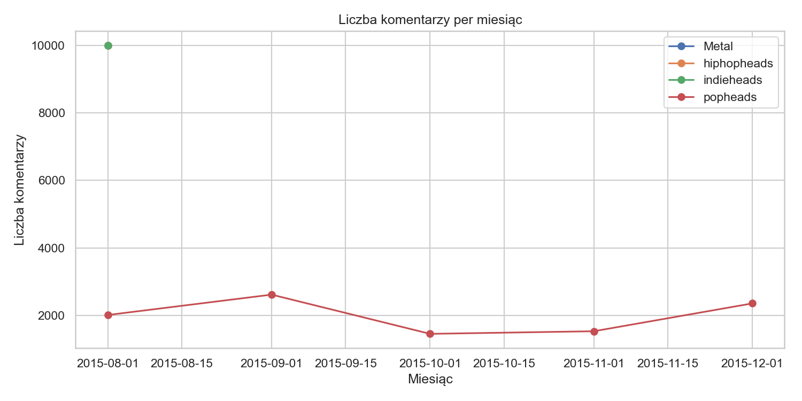
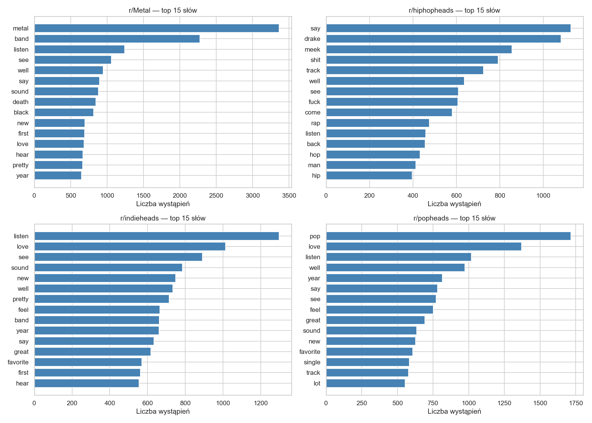
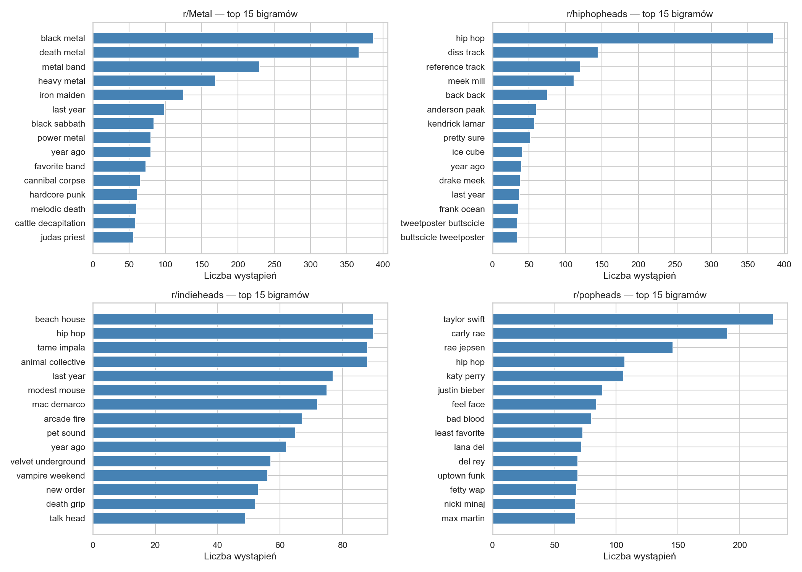
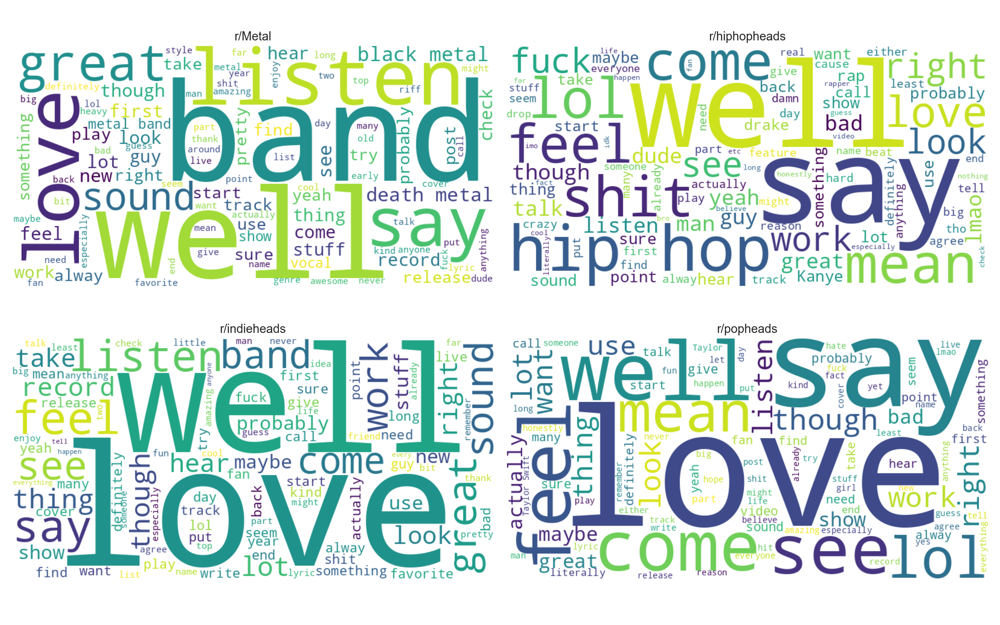
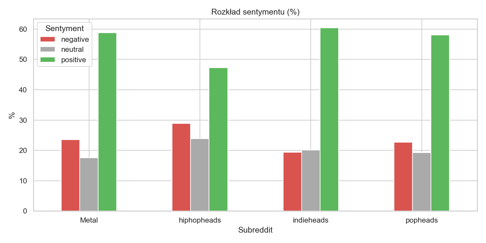
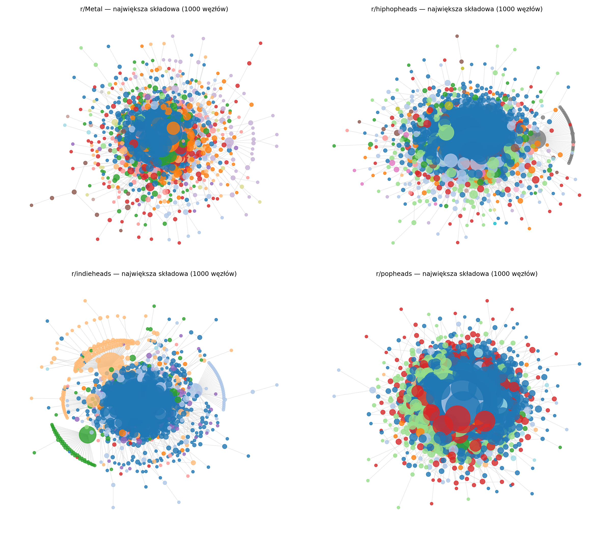

# Reddit Music Community Analysis

A comparative analysis of discussion topics and user interaction patterns across music-focused subreddits during the first year of the COVID-19 pandemic, using NLP and social network analysis.

## Research Question

Do subreddits dedicated to different music genres differ in the topics they discuss and how their users interact with each other during the first year of the COVID-19 pandemic (March 2020 – March 2021)?

## Dataset

| Subreddit     | Genre   | Comments  | Unique Authors |
| ------------- | ------- | --------- | -------------- |
| r/hiphopheads | Hip-hop | 1,291,468 | 110,058        |
| r/indieheads  | Indie   | 367,958   | 51,588         |
| r/Metal       | Metal   | 106,181   | 17,049         |
| r/popheads    | Pop     | 778,576   | 37,077         |

**Time period:** March 11, 2020 – March 11, 2021 (first year of COVID-19 pandemic)  
**Source:** [Pushshift Reddit Dataset](https://the-eye.eu/redarcs/)

## Methods

| Analysis Type      | Techniques                                                               |
| ------------------ | ------------------------------------------------------------------------ |
| Text Mining        | Word frequency analysis, bigrams, LDA topic modeling                     |
| Sentiment Analysis | VADER sentiment intensity analysis                                       |
| Network Analysis   | Degree centrality, betweenness centrality, community detection (Louvain) |

## Results

### Community Activity Over Time



### Most Discussed Topics

**Word Frequencies:**


**Bigrams (two-word phrases):**


**Word Clouds:**


### Sentiment Distribution

All four subreddits exhibit predominantly positive sentiment across comments. r/popheads and r/indieheads demonstrate the highest average sentiment scores, while r/hiphopheads shows more neutral sentiment — partly attributable to VADER's limited capacity for processing hip-hop vernacular and slang.



| Subreddit     | Mean  | Median |
| ------------- | ----- | ------ |
| r/popheads    | 0.299 | 0.361  |
| r/indieheads  | 0.285 | 0.341  |
| r/Metal       | 0.175 | 0.153  |
| r/hiphopheads | 0.088 | 0.000  |

### Network Structure and Communities

User interaction networks reveal distinct community clusters within each subreddit. Nodes represent individual users and edges represent reply interactions.



## Project Structure

```
├── data/
│   ├── raw/              # Raw .zst files from Pushshift (not included in repository)
│   └── processed/        # Extracted and filtered CSV files (not included in repository)
├── notebooks/
│   ├── 01_eda.ipynb              # Exploratory data analysis
│   ├── 02_text_mining.ipynb      # Topic modeling and sentiment analysis
│   └── 03_network_analysis.ipynb # User interaction networks
├── src/
│   ├── scan_dates.py     # Utility to verify date ranges in .zst files
│   └── extract_data.py   # Extract and filter comments from .zst to CSV
├── outputs/
│   └── figures/          # Generated visualizations
└── requirements.txt      # Python dependencies
```

## Setup Instructions

### Prerequisites

- Python 3.9+
- Pip or Conda

### Installation

```bash
pip install -r requirements.txt
python -m spacy download en_core_web_sm
```

### Data Preparation

To reproduce the analysis from raw Pushshift data:

1. Download `.zst` files from [Pushshift](https://the-eye.eu/redarcs/) and place in `data/raw/`
2. Run `python src/scan_dates.py` to verify date ranges
3. Run `python src/extract_data.py` to extract and filter comments to `data/processed/`
4. Execute notebooks in sequence: `01_eda.ipynb` → `02_text_mining.ipynb` → `03_network_analysis.ipynb`

## Technologies

**Data Processing:** pandas, NumPy  
**NLP:** spaCy, NLTK, Gensim (LDA), VADER Sentiment  
**Network Analysis:** NetworkX, python-louvain  
**Visualization:** Matplotlib, Seaborn, WordCloud
